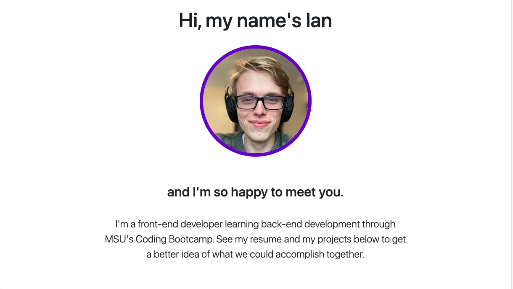

# My Portfolio
This is my personal portfolio. I've linked five of the projects I'm proudest of, my resume, and different ways to contact me (of course, the phone number I have listed is not my own). 

I have a number of future plans to improve the site. For example, I'd like to include more animations to enrich the UX, I'd like to use icons for my project buttons (rather than screenshots of the projects themselves), and I'd like to make the Contact section more like a footer rather than a dedicated section of the page. Furthermore, I'd like to dedicate a section in my portfolio to my philosophical endeavors, but I haven't yet found the best way to do that, so this section is currently more of a placeholder than anything. 

## Deployment 
To visit this website, simply follow this [link](https://rflctveq.github.io/ian-everitt-portfolio/) or enter the following into your address bar: https://rflctveq.github.io/ian-everitt-portfolio/. 

## Technologies Used 
* Bootstrap 4.6.0

* jQuery 3.5.1 

* GreenSock Animation Platform 3.6.0 

* GitHub Pages (host)

## Screenshots
Here's are a couple images of my portfolio as seen on a desktop:

And here's an image as seen on an iPhone X: 

## Contact 
### Ian Everitt 
* Email me: ian.andrew.everitt@gmail.com 