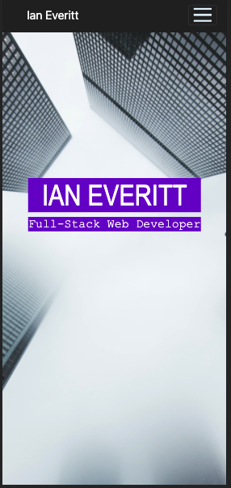

# My Portfolio
This is my personal portfolio. I've linked six of the projects I'm proudest of, my resume, and different ways to contact me. 

I have a number of future plans to improve the site. For example, I'd like to include more animations to enrich the UX, I'd like to use icons for my project buttons (rather than screenshots of the projects themselves), and I'd like to make the Contact section more like a footer rather than a dedicated section of the page. I'd also like to include functionality to allow people to contact me directly through my site. Furthermore, I think I'd like to dedicate a section in my portfolio to my philosophical endeavors, but I haven't yet found the best way to do that. 

## Deployment 
To visit this website, simply follow this [link](https://rflctveq.github.io/ian-everitt-portfolio/) or enter the following into your address bar: https://rflctveq.github.io/ian-everitt-portfolio/. 

## Technologies Used 
* Bootstrap 4.6.0

* jQuery 3.5.1 

* GreenSock Animation Platform 3.6.0 

* GitHub Pages (host)

## Screenshots
Here are a couple images of my portfolio as seen on a desktop:

And here's an image as seen on an iPhone X: 

## Contact 
### Ian Everitt 
* Email me: ian.andrew.everitt@gmail.com 

## License 

Copyright (c) 2021 Ian Everitt Portfolio

Permission is hereby granted, free of charge, to any person obtaining a copy
of this software and associated documentation files (the "Software"), to deal
in the Software without restriction, including without limitation the rights
to use, copy, modify, merge, publish, distribute, sublicense, and/or sell
copies of the Software, and to permit persons to whom the Software is
furnished to do so, subject to the following conditions:

The above copyright notice and this permission notice shall be included in all
copies or substantial portions of the Software.

THE SOFTWARE IS PROVIDED "AS IS", WITHOUT WARRANTY OF ANY KIND, EXPRESS OR
IMPLIED, INCLUDING BUT NOT LIMITED TO THE WARRANTIES OF MERCHANTABILITY,
FITNESS FOR A PARTICULAR PURPOSE AND NONINFRINGEMENT. IN NO EVENT SHALL THE
AUTHORS OR COPYRIGHT HOLDERS BE LIABLE FOR ANY CLAIM, DAMAGES OR OTHER
LIABILITY, WHETHER IN AN ACTION OF CONTRACT, TORT OR OTHERWISE, ARISING FROM,
OUT OF OR IN CONNECTION WITH THE SOFTWARE OR THE USE OR OTHER DEALINGS IN THE
SOFTWARE.